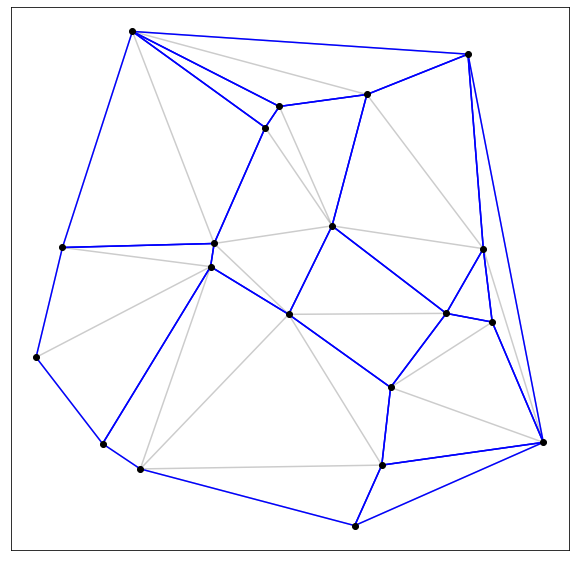
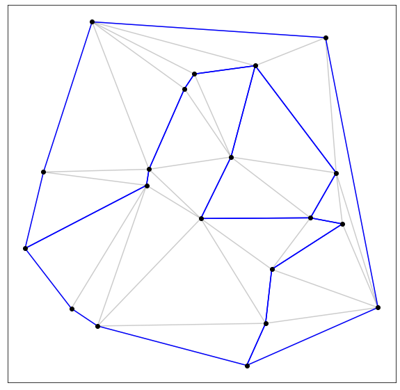
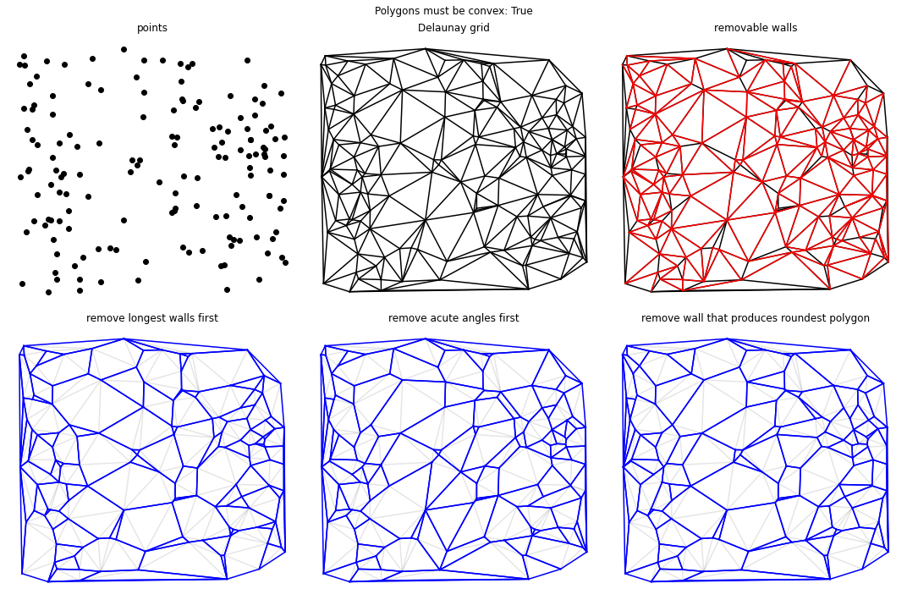
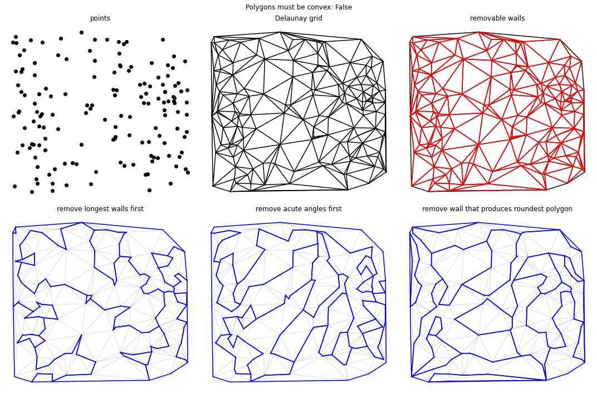

# Polygonation

Small scipt to divide the convex hull around a set of points up into polygons.

Done by identifying the removable edges, and then removing one of them by some selection criterion. Rinse-repeat until no further edges can be removed.

Not optimized or anything. For example, all candidiates are recalculated after removing an edge.

Sample use, finding a set of convex polygons:
```python
n = 20
points = np.random.rand(n*2).reshape(-1, 2)
pg = Polygonate(points)
# drawing the result
fig, ax = plt.subplots(1, 1, figsize=(10,10))
pg.plotdelaunay(ax, alpha=0.2)
pg.plotpolygons(ax)
pg.plotpoints(ax)
```


And finding a set of polygons when letting go of the convex criterion:
```python
n = 20
points = np.random.rand(n*2).reshape(-1, 2)
pg = Polygonate(points, convex=False)
# drawing the result
fig, ax = plt.subplots(1, 1, figsize=(10,10))
pg.plotdelaunay(ax, alpha=0.2)
pg.plotpolygons(ax)
pg.plotpoints(ax)
```



---

There are 3 options for picking which edge to remove; here is a comparison:

`convex=True`



`convex=False`


