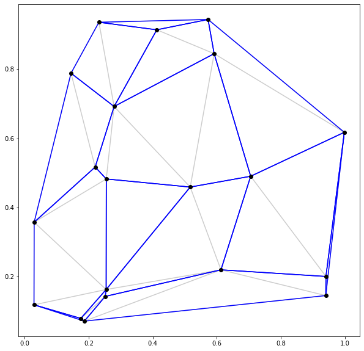

# Polygonation

Small scipt to find a set of polygons that is non-overlapping and whose vertices are given by a set of points.

Done by identifying the removable walls, and then removing one of them. Rinse-repeat until no further walls can be removed.

Not optimized or anything. For example, all candidiates are recalculated after removing a wall, and the Delaunay grid is calculated several times.

Sample use, finding a set of convex polygons:
```python
n = 20
points = np.random.rand(n*2).reshape(-1, 2)
polygons = polygonate(points, 'sharp')
# drawing the result
fig, ax = plt.subplots(1, 1, figsize=(10,10))
plotdelaunay(ax, points, alpha=0.2)
plotpolygons(ax, points, polygons)
plotpoints(ax, points)
```


